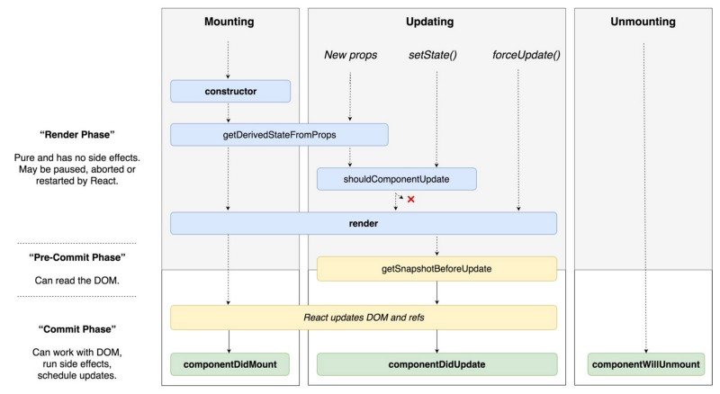

#### use of `Hooks`
- [x] State
- [x] Lifecycle Methods
- [x] Sharing Non-Visual Logic


#### Hooks Rules
- [x] Never call Hooks from inside a loop, condition or nested function
- [x] Hooks should sit at the top-level of your component
- [x] Only call Hooks from React functional components
- [x] Never call a Hook from a regular function
- [x] Hooks can call other Hooks


#### useState(lazy initialization)
- if we need initial state on the first render only, then we can pass a `callback` to `useState`
- `callback` returns the initial state
```js
const initState = () => Number(window.localStorage.getItem('count'));
```

#### setState(Callback)
- compute new state based on previous state
```js
setCount((prevCount) => prevCount + 1);
```

#### useEffect
- the hook that runs side-effects independently of rendering
- callback is executed right after changes were being pushed to DOM
- SideEffect Ex : API Calls, DOM Manipulation, setTimeout
- The component rendering and side-effect logic are independent
- https://dmitripavlutin.com/dbe428bafd5308bb2744d7c315c81d9a/react-useeffect-callback-cleanup-3.svg
```js
useEffect(() => { }) // Every Time
useEffect(() => { }, []) // On Mount
useEffect(() => { }, [id, authed]) // when deps change
```


#### Cleanup works the following way
- After initial rendering, useEffect() invokes the callback having the side-effect. cleanup function is not invoked.
- On later renderings, before invoking the next side-effect callback, useEffect() invokes the cleanup function from the previous side-effect execution (to clean up everything after the previous side-effect), then runs the current side-effect.
- Finally, after unmounting the component, useEffect() invokes the cleanup function from the latest side-effect.

```js
// Custom Hook -- to share logic between Components
function useRepos(id) {
  const [repos, setRepos] = useState([]); // Local State
  const [loading, setLoading] = useState(true); // Local State

  useEffect(() => { // componentDidMount & componentDidUpdate
    
    setLoading(true);

    fetchRepos(id).then(repos => {
      setRepos(repos);
      setLoading(false);
    });
  }, [id]);

  return [loading, repos];
}
```

#### React.memo
- React.memo is a higher-order component
- React renders the component and memoizes the result
- Before the next render, if the new props are the same, React reuses the memoized result skipping the next rendering
- You gain a performance boost: by reusing the memoized content
- React skips rendering the component and doesn't perform a virtual DOM difference check
- React always re-renders the component if the state changes, even if the component is wrapped in React.memo().

#### useCallback
- given the same dependency values, the hook returns the same function instance between renderings
- handleClick variable has always the same callback function object between renderings
- onItemClick callback is memoized by useCallback(). As long as term is the same, useCallback() returns the same function object

in some cases you need to maintain a single function instance between renderings
- function has some internal
- When the function object is a dependency to other hooks
- A functional component wrapped inside React.memo()


#### useRef
- takes the initial value and returns a reference
- reference.current accesses the reference value, and reference.current = newValue updates the reference value
- The value of the reference is persisted (stays the same) between component re-renderings
- Updating a reference doesn't trigger a component re-rendering
- The reference update is synchronous
- the state update is asynchronous


```js
const InputEl = () => {
  const inputRef = useRef();

  useEffect(() => {
    console.log(inputRef.current); // Logs `HTMLInputElement`
    inputRef.current.focus();
  }, []);

  console.log(inputRef.current); // Logs `undefined` during initial rendering
  return <input ref={inputRef} type="text" />;
};
```

**`Mounting Stage` -- called in the following order**
> constructor()  
> static getDerivedStateFromProps()  
> render()  
> componentDidMount()  


**`Updating Stage` -- called in the following order**
> static getDerivedStateFromProps()  
> shouldComponentUpdate()  
> render()  
> getSnapshotBeforeUpdate()  
> componentDidUpdate()  

**`Unmounting Stage` -- called in the following order**
> componentWillUnmount()  

**Removed Methods**
 - componentWillUpdate()
 - componentWillReceiveProps()
 - componentWillMount()


# React Life Cycle Hooks


**constructor**
- [x] initialize `state`
- [x] before `mounted`

**getDerivedStateFromProps**
- [x] called `before` `render` method
- [x] initial `mount` and on subsequent `updates`
- [x] return `object` to update the `state` or `null`

**shouldComponentUpdate**
 - [x] return `false` will prevent `re-rendering`

**componentDidMount**
- [x] after attached to the DOM
- [x] fetch API

**componentWillUnmount**
- [x] before dettached from the DOM
- [x] Perform any necessary cleanup

**componentDidUpdate**
- [x] after `update`
- [x] will not be invoked if shouldComponentUpdate() returns `false`

```js
this.setState((state, props) => {
  return {counter: state.counter + props.step};
});
```

**PureComponent** performs a shallow comparison of `props` and `state`, and reduces the chance that you’ll skip a necessary update

compare `this.props` with `nextProps` and `this.state` with `nextState` and return `false` to tell React the update can be skipped


Life_Cycle : created, rendered, updated, removed

# Class Components

#### `componentWillMount()`
- Invoked once, both on the client and server, immediately before the initial rendering occurs

#### `componentWillReceiveProps(nextProps)` 
- Invoked when a component is receiving new props
- This method is not called for the initial render. 
- Calling this.setState() within this function will not trigger an additional render. 

#### `componentWillUnmount()` 
- Invoked immediately before a component is unmounted from the DOM
- Perform any necessary cleanup in this method, such as invalidating timers or cleaning up any DOM elements that were created in componentDidMount

#### `componentDidMount()`
- Invoked once, only on the client (not on the server), immediately after the initial rendering occurs
- At this point in the lifecycle, you can access any refs to your children
- The componentDidMount() method of child components is invoked before that of the parent component
  
#### `componentDidUpdate(prevProps, prevState)`
- Invoked immediately after the component's updates are flushed to the DOM
- This method is not called for the initial render
- Use this as an opportunity to operate on the DOM when the component has been updated.

#### `shouldComponentUpdate(nextState, nextProps)`
- Invoked before rendering when new props or state are being received
- This method is not called for the initial render or when forceUpdate() is used
- Use this as an opportunity to return false when you're certain that the transition to the new props and state will not require a component update

#### `VDOM`
- Changes are batched together
- Changes are made to the `VDOM` instead of `DOM` 
- React creates a diff between the current representation and the previous representation persisted to the `DOM`, then applies the diff to the `DOM`

#### `Keys`
- With keys, React would actually re-order the DOM elements

#### `HOC`
- function that takes a `component` and returns a new `component`
- wraps the `component` with additional props
- HOC takes another component as argument

#### `Render Prop`
- `function prop` that is called in a `render` method