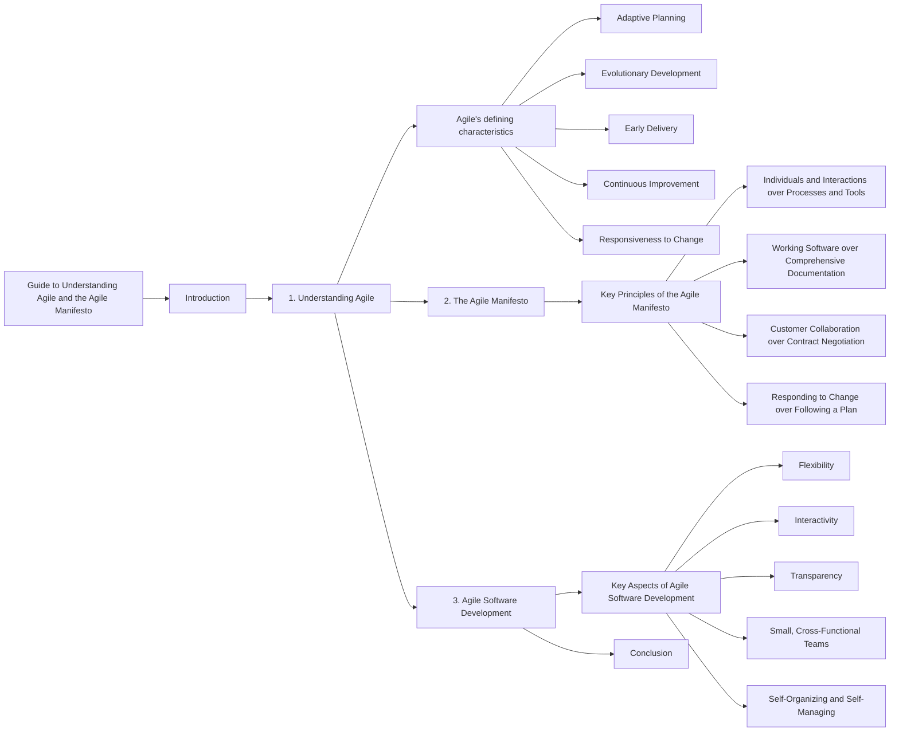

# What-is-Agile

1️⃣  Value #1: Individuals and interactions

Successful teams prioritize finding the right people and making sure they communicate frequently. Good tools and processes help, but focusing on the individuals and their interactions will yield the best results.

For example, the world's best guitar is useless to someone that doesn't know how to play it. Making a beautiful song (or product) requires highly skilled people that can collaborate effectively.

Your team should do the same: prioritize people and communicate often. Frequent discussions across the team help uncover critical information to keep the work moving forward.

---

2️⃣  Value #2: Working software

Successful teams prioritize delivering a product that works. Not to make it perfect. This value applies to any work you deliver to customers, not just software.

Before agile, teams would try to build against the full scope of project requirements, allowing very little flexibility.

Instead, your team should look for a few critical features to deliver as a  Minimum Viable Product  (or MVP). Then, the team should prioritize building the MVP and get it in the customers' hands as quickly as possible.

This practice gives customers a working product. And it allows your team to get real-time feedback to improve future iterations.

---

3️⃣   Value #3: Customer collaboration

Successful teams prioritize frequent collaboration with stakeholders and customers. Think of your customers as partners, working closely to design the best solution.

Before agile, teams would spend a lot of time detailing a final product before the work started. The problem was that these original details rarely ended up providing much value in the end.

Instead, you should partner closely with your customer throughout the process and be ready to adapt to changing needs and requirements. Gather feedback frequently to help your customers quickly solve their highest priority problems.

---

4️⃣  Value #4: Responding to change

Successful teams stay flexible and ready to adapt to unforeseen changes. Starting with a plan is always a good idea. But don't be overly rigid in sticking to it.

It's important to recognize in work (and life) that change is the only constant. Markets, teams, projects, and situations are constantly in flux. 

You and your team will be most successful if you prepare your mind for constant changes, and be ready to make intelligent pivots on a whim.

---

Our highest priority is to satisfy the customer through early and continuous delivery of valuable software.
Welcome changing requirements, even late in development. Agile processes harness change for the customer's competitive advantage.
Deliver working software frequently, from a couple of weeks to a couple of months, with a preference to the shorter timescale.
Business people and developers must work together daily throughout the project.
Build projects around motivated individuals. Give them the environment and support they need, and trust them to get the job done.
The most efficient and effective method of conveying information to and within a development team is face-to-face conversation.
Working software is the primary measure of progress.
Agile processes promote sustainable development. The sponsors, developers, and users should be able to maintain a constant pace indefinitely.
Continuous attention to technical excellence and good design enhances agility.
Simplicity--the art of maximizing the amount of work not done--is essential.
The best architectures, requirements, and designs emerge from self-organizing teams.
At regular intervals, the team reflects on how to become more effective, then tunes and adjusts its behavior accordingly.

---

✅   1.  Show respect for all team members

Healthy, high-performing teams create a culture of trust and mutual respect. That's the backbone of agility. 

Having an agile mindset means you embrace different ways of thinking and working, even if you don't always agree with them. Focus on keeping an open mind and seeking to understand new and unexpected ideas.

✅   2.  Communicate openly and clearly

Share updates. Ask questions. Be open and transparent at all times. With each interaction, challenge yourself to communicate clearly and concisely. 

Encourage your team to engage in frequent discussions. Quality discussions can reveal critical information that moves the work forward and helps the team feel more connected.

✅  3.  Look for ways to innovate

Agility is all about delivering maximum value to customers. When a customer's needs change, you need to respond quickly with an innovative solution.

Having an agile mindset means you're constantly looking for opportunities to innovate. This could mean improving your team's internal processes. Or enhancing features of the product you're building.

As you complete your daily tasks, think if there are ways to improve what you're doing. Analyzing and improving your team's work will be valuable for your future career.

✅   4.  Actively improve your skills

Agile is all about continuous improvement. In your daily work, always look for opportunities to learn and grow your skillset.

Pause for a minute and think about your current skills: Which skills seem to be most valuable? Which skills mesh well with your natural tendencies? Use these questions as a starting point to help you plan which skills to sharpen.

Prioritizing your skill development is always a good idea. Not only does it help your team, but it also improves your future career opportunities.

✅   5.  Your work doesn't have to be perfect

Your goal is to deliver something that works; an MVP. Not to make every detail perfect.

Shift your mindset to focus on doing "good enough" work, and then get immediate feedback to improve the next version. Try to adopt this approach for both large and small tasks.

"Good enough" is different for every team and every project. If the parameters are not clear, you may want to discuss them with your team leader.

✅   6.  Have a plan, but always be ready to pivot

An agile mindset is about being flexible and ready for any unpredictable change. Yes, you should always have a Plan A (and B and C, if time allows). But you'll be most successful at work if your mind is always prepared to pivot.

Change will come. It always does. Your job is to prepare your brain to stay calm and collected so that you can handle each emotional wave with ease. If everyone on the team is ready for change, you'll be able to bounce back quickly and refocus energy on solving new problems.

---

# Guide to Understanding Agile and the Agile Manifesto

## Introduction
Agile is an iterative approach to project management that focuses on responsiveness and delivering value quickly to customers. This guide will provide an overview of Agile, its defining characteristics, and explain the philosophy behind the Agile Manifesto.

## 1. Understanding Agile
Agile is an iterative project management approach that emphasizes small increments of work and continuous feedback from customers. Unlike traditional planning methods, Agile allows for adaptive planning and evolving development.

- Agile's defining characteristics:
  - Adaptive Planning: Rather than planning an entire year's worth of work, Agile focuses on planning small iterations to deliver value and receive feedback from customers.
  - Evolutionary Development: Agile promotes building software in small increments and evolving it over time based on customer feedback.
  - Early Delivery: Agile emphasizes the importance of delivering iterations to customers early to obtain valuable feedback for improvement.
  - Continuous Improvement: Agile enables teams to continuously improve both their work processes and the product by incorporating customer feedback.
  - Responsiveness to Change: Agile allows teams to respond quickly to changing requirements and adapt their plans based on customer needs.

## 2. The Agile Manifesto
The Agile Manifesto is a set of principles that guide Agile software development. It values certain aspects more than others to ensure customer satisfaction and flexibility throughout the development process.

- Key Principles of the Agile Manifesto:
  - Individuals and Interactions over Processes and Tools: Prioritizing effective communication and collaboration among team members and with customers rather than relying solely on processes and tools.
  - Working Software over Comprehensive Documentation: Placing more importance on delivering functional software rather than extensive documentation.
  - Customer Collaboration over Contract Negotiation: Emphasizing the collaboration and active involvement of customers in the development process, instead of focusing solely on contractual agreements.
  - Responding to Change over Following a Plan: Valuing the ability to respond and adapt to changing requirements instead of strictly adhering to a predefined plan.

## 3. Agile Software Development
Agile software development aligns with the principles of the Agile Manifesto. It emphasizes keeping the core values in mind while focusing on flexibility, interactivity, and transparency.

- Key Aspects of Agile Software Development:
  - Flexibility: Agile teams embrace change and adapt their plans and development process accordingly.
  - Interactivity: Effective communication and collaboration among team members and customers are crucial for successful Agile development.
  - Transparency: Agile teams promote transparency by ensuring that everyone knows what others are working on and fostering a sense of responsibility towards delivering value to customers.
  - Small, Cross-Functional Teams: Agile teams are composed of small, co-located, cross-functional members who work together to achieve project goals.
  - Self-Organizing and Self-Managing: Agile teams have autonomy and take ownership of their work, organizing themselves to maximize productivity and efficiency.

## Conclusion
Agile is an iterative and collaborative approach to software development that values customer satisfaction and flexibility. The Agile Manifesto outlines the core principles that guide Agile development, emphasizing the importance of individuals, working software, customer collaboration, and responsiveness to change. By implementing Agile methodologies and embracing its core values, teams can deliver high-quality software that meets evolving customer needs.

# Guide to Waterfall, Extreme Programming, and Kanban in Software Development

## Introduction
In software development, different approaches and methodologies are used to manage projects and deliver high-quality software. This guide explores the Waterfall approach, the Extreme Programming (XP) approach, and the Kanban methodology. We will discuss the problems with the Waterfall approach, explain the principles and values of XP, and define Kanban along with its core principles.

## 1. Waterfall Approach
The Waterfall approach is a traditional, sequential method of software development that follows a linear progression from one phase to another. Here is a breakdown of the typical Waterfall process:

1. Requirements Phase: Gathering and documenting all the customer's requirements for the system.
2. Design Phase: Creating a detailed design based on the gathered requirements.
3. Coding Phase: Writing the actual code based on the design.
4. Integration Phase: Combining the separate modules or components to form a working system.
5. Testing Phase: Evaluating the system to identify and fix any bugs or issues.
6. Deployment Phase: Releasing the software to the production environment.

### Problems with the Waterfall Approach:
- Lack of Change Provision: The Waterfall approach has no provision for accommodating changes once a phase is completed, leading to inflexibility.
- Limited Feedback and Delivery: Intermediate deliverables are not provided until the final deployment phase, making it difficult to assess progress and gather feedback from customers.
- Information Loss and Blocking: Passing work from one phase to another increases the risk of losing information and creating bottlenecks if the subsequent phase cannot accept the work.
- Costly Mistake Corrections: Discovering mistakes or design flaws late in the process can be expensive and time-consuming to rectify.
- Long Lead Times: The entire development process, from initial requirements to deployment, can have lengthy lead times, resulting in delayed software delivery.

## 2. Extreme Programming (XP) Approach
Extreme Programming (XP) is an Agile software development methodology introduced in 1996 by Kent Beck. It is an iterative approach that emphasizes frequent feedback, collaboration, and responsiveness to change. The key values of XP are:

1. Simplicity: Delivering only what is necessary and avoiding unnecessary complexity.
2. Communication: Encouraging open and frequent communication among team members.
3. Feedback: Establishing feedback loops to continuously assess progress and make improvements.
4. Respect: Valuing each team member's opinions, expertise, and contributions.
5. Courage: Being honest about capabilities and commitments, and embracing change when necessary.

XP operates within short iterations or cycles, with a focus on continuous improvement, customer involvement, and delivering high-quality software incrementally.

## 3. Kanban Methodology
Kanban is a visual and lean methodology derived from the Japanese manufacturing system. It promotes a continuous flow of work and emphasizes efficiency and productivity. The core principles of Kanban are:

1. Visualize the Workflow: Creating a visual representation of the work process to enhance understanding and transparency.
2. Limit Work in Progress (WIP): Restricting the number of tasks or items in progress at any given time to prevent bottlenecks and improve flow.
3. Manage and Enhance Flow: Analyzing and optimizing the workflow to improve efficiency and reduce lead times.
4. Make Policies Explicit: Defining clear guidelines and rules for how work is done and what constitutes completion.
5. Continuously Improve: Encouraging regular reflection, feedback, and adaptation to drive ongoing improvement and innovation.

Kanban boards are often used to visualize work items, track progress, and facilitate collaboration within Agile teams.

## Conclusion
Understanding different software development approaches is essential for selecting the most suitable methodology for a given project. The Waterfall approach, although structured, can lead to

 inflexibility, delayed feedback, and costly corrections. On the other hand, Extreme Programming (XP) emphasizes iterative development, customer collaboration, and continuous improvement. Kanban, derived from lean manufacturing principles, focuses on visualizing workflow, limiting work in progress, and optimizing flow. Each approach offers unique advantages and can be adapted to various project requirements and team dynamics.

By incorporating Agile methodologies like XP and Kanban, software development teams can enhance collaboration, responsiveness, and overall project success.

---

# Agile and Scrum: A Comprehensive Guide

This guide will help you understand the key differences between Agile and Scrum, define the characteristics of the Scrum methodology, and describe the step-by-step process of implementing Scrum.

## Agile vs. Scrum

Agile and Scrum are often used interchangeably, but it's essential to recognize their distinctions. Agile is a philosophy that provides a flexible approach to work, while Scrum is a specific methodology within the Agile framework that offers a more structured process for working in an agile manner.

### Agile

Agile is a philosophy for doing work that promotes flexibility, adaptability, and collaboration. It emphasizes iterative and incremental development, customer collaboration, and rapid responses to change. Agile does not prescribe specific processes but encourages teams to find the most effective way to deliver value.

### Scrum

Scrum is a management framework designed for incremental product development within an Agile environment. It focuses on small, cross-functional, self-managing teams and provides a structure of roles, rules, and artifacts to guide the development process. Scrum utilizes fixed-length iterations called sprints to deliver potentially shippable increments of the product.

## The Scrum Process

The Scrum process consists of several key steps that ensure effective product development. Let's explore each of these steps in detail:

1. **Product Backlog:** The product backlog is an exhaustive list of all the desired features, enhancements, and improvements for the product. It serves as a comprehensive to-do list for the development team.

2. **Backlog Refinement:** During backlog refinement, the team reviews and analyzes the items in the product backlog to ensure they are "sprint ready." This involves clarifying requirements, breaking down larger tasks, and estimating effort for each item.

3. **Planning Meeting:** In the planning meeting, the team selects a subset of items from the product backlog to form the sprint backlog. The sprint backlog includes only the stories and tasks to be accomplished during the upcoming sprint, typically lasting two weeks.

4. **Sprint Execution:** The team works on the selected items from the sprint backlog for the duration of the sprint. Daily Scrum or stand-up meetings are conducted to synchronize activities, address any challenges, and provide updates on progress. Each team member answers three questions: What did you do yesterday? What are you going to do today? Are there any obstacles in your way?

5. **Sprint Review:** At the end of each sprint, a sprint review is conducted to showcase the work completed during the iteration. Feedback is gathered from stakeholders, and the product owner verifies if the increment meets the desired objectives.

6. **Sprint Retrospective:** The sprint retrospective is a team reflection session to assess what went well, identify areas for improvement, and plan actions for the next sprint. This feedback loop ensures continuous learning and optimization.

7. **Agile Iterations:** Agile development is an iterative process that repeats the design, code, test, and deploy cycle. The product evolves through repeated iterations, incorporating customer feedback and continuously delivering value.

## Conclusion

In summary, Scrum is a methodology that falls within the broader Agile framework. It provides a structured approach to incremental product development, emphasizing small, self-managing teams and fixed-length iterations called sprints. By following the Scrum process, teams can collaborate effectively, respond to change quickly, and deliver potentially shippable increments of the product at the end of each sprint. Remember that Agile and Scrum require practice and experience to master, so consider seeking guidance from experienced practitioners to maximize your success with this methodology.

---

# Scrum Roles: A Comprehensive Guide

In this guide, we will explore the three essential roles in Scrum, explain their responsibilities, and provide insights into how they contribute to successful Scrum implementation. The three roles in Scrum are the Product Owner, Scrum Master, and Scrum Team.

## 1. Product Owner

The Product Owner plays a crucial role in Scrum by representing the stakeholders and ensuring their interests are understood and addressed. Here's what you need to know about the Product Owner:

- **Vision and Decision-making:** The Product Owner is responsible for establishing and communicating the product vision. They make critical decisions about the product, including potential pivots or persevering with the current direction.
- **Stakeholder Liaison:** As the liaison between the Scrum Team and stakeholders, the Product Owner gathers stakeholder requirements and communicates them effectively to the team.
- **Product Backlog Management:** The Product Owner manages the product backlog, which is a comprehensive list of all desired features, enhancements, and improvements. They constantly reprioritize the backlog and ensure it is ready for the next sprint.
- **Requirement Arbiter:** The Product Owner makes final decisions on requirements, clarifies doubts, and provides necessary details to the Scrum Team during backlog refinement and sprint planning.
- **Acceptance of Increments:** The Product Owner accepts or rejects each product increment based on alignment with stakeholder expectations and the product vision.
- **Product Direction and Perseverance:** The Product Owner determines whether to continue development, pivot the product direction, or persevere with the current approach.

## 2. Scrum Master

The Scrum Master is responsible for facilitating the Scrum process and ensuring its effective implementation. Here's an overview of the Scrum Master's role:

- **Scrum Process Facilitation:** The Scrum Master guides and supports the Scrum Team throughout the Scrum process. They possess extensive knowledge of Scrum practices and mentor the team to ensure adherence to Scrum principles.
- **Agile Coaching:** The Scrum Master serves as an Agile coach, helping the team embrace Agile values, practices, and mindset. They foster an environment that encourages self-organization and continuous improvement.
- **Enabling Self-Organization:** The Scrum Master creates an environment where the Scrum Team can be self-organizing. They empower the team to make decisions, commit to sprint goals, and determine how work is assigned and accomplished.
- **Removing Impediments:** The Scrum Master's priority is to identify and resolve any impediments or obstacles that hinder the progress of the Scrum Team. They ensure that the team remains focused and unblocked.
- **Timeboxing and Meeting Facilitation:** The Scrum Master enforces timeboxes for Scrum events, such as daily stand-ups and sprint reviews. They ensure meetings are efficient, effective, and stay within the allocated time limits.
- **Data Capture and Forecasting:** The Scrum Master captures empirical data, monitors progress, and adjusts forecasts. They utilize tools like burndown charts to provide insights into the team's performance.

## 3. Scrum Team

The Scrum Team consists of individuals with diverse skills who collaborate to deliver the product increment. Here are the key characteristics and responsibilities of the Scrum Team:

- **Cross-functional Collaboration:** The Scrum Team comprises individuals with different skills and expertise, including developers, testers, business analysts, domain experts, and operations personnel. This cross-functional collaboration ensures a holistic approach to product development.
- **Self-Organizing and Self-Managing:** The Scrum Team is self-organizing and self-managing, meaning they have the autonomy to assign and manage their own work. They decide how to accomplish the sprint goals and continuously improve their processes.
- **Optimal Team Size:** A

Scrum Team is ideally composed of 7±2 members, but some practitioners recommend a smaller size, such as 5±2, to enhance collaboration and efficiency.
- **Co-location:** Co-location refers to having the Scrum Team members physically located together. It promotes better communication, collaboration, and real-time problem-solving. However, if geographical dispersion is unavoidable, it's advisable to have at least two team members in each location for effective collaboration.
- **Active Participation:** Each member of the Scrum Team actively participates in sprint activities, including daily stand-ups, sprint planning, sprint reviews, and retrospectives. They collaborate and share knowledge to accomplish the sprint goals and deliver the product increment.

Remember, effective collaboration and clear communication among the Product Owner, Scrum Master, and Scrum Team are crucial for successful Scrum implementation. Each role contributes unique expertise and responsibilities to ensure the efficient delivery of high-quality products.

---

# Scrum Artifacts, Events, and Benefits: A Comprehensive Guide

This comprehensive guide will provide you with a clear understanding of Scrum artifacts, events, and the numerous benefits associated with implementing Scrum. Let's dive in!

## Scrum Artifacts

Scrum utilizes three key artifacts to support the product development process:

1. **Product Backlog:** The product backlog is an exhaustive list of all the desired features, enhancements, and improvements for the product. It represents the product's requirements that are yet to be implemented. It serves as the primary source for selecting work items for each sprint.

2. **Sprint Backlog:** The sprint backlog consists of the subset of items from the product backlog that are selected for implementation during the upcoming sprint. It includes the user stories and tasks that the Scrum Team commits to completing within the sprint.

3. **Done Increment:** A done increment refers to a product increment that is considered complete at the end of a sprint. The Scrum Team works diligently during the sprint to deliver a potentially shippable product increment. A done increment signifies that the work has been successfully accomplished.

## Scrum Events

Scrum incorporates five core events, also known as ceremonies or meetings, to facilitate effective collaboration and progress:

1. **Sprint Planning Meeting:** The sprint planning meeting initiates the sprint. The Scrum Team, including the Product Owner and Scrum Master, gathers to plan and determine the scope of work for the upcoming sprint. They decide which items from the product backlog will be included in the sprint backlog, committing to their completion.

2. **Daily Scrum or Daily Stand-up Meeting:** The daily Scrum meeting is a short, time-boxed meeting held every day, usually at the same time and location. The Scrum Team synchronizes and updates each other on their progress, plans for the day, and any impediments they may be facing. The Scrum Master helps remove any obstacles mentioned during this meeting.

3. **Sprint Execution:** The sprint is the time frame during which the Scrum Team actively works on the items in the sprint backlog. They collaborate, develop, test, and refine the product increment within the specified sprint duration.

4. **Sprint Review:** The sprint review occurs at the end of each sprint. The Scrum Team demonstrates the completed work to stakeholders, showcasing the progress made and the newly added features. Feedback is collected and considered for future iterations.

5. **Sprint Retrospective:** The sprint retrospective is a reflective session conducted after the sprint review. The Scrum Team reflects on the sprint and discusses what went well, what could be improved, and any changes they would like to implement in future sprints. This retrospective helps the team continuously improve and optimize their work processes.

## Benefits of Scrum

Implementing Scrum offers numerous benefits that contribute to successful product development and team dynamics. Here are some key advantages:

1. **Higher Productivity:** Scrum promotes higher productivity by providing clear goals, facilitating daily communication, and emphasizing self-organization. Teams become more efficient and focused, leading to increased output.

2. **Improved Quality:** Scrum teams prioritize quality through iterative development, continuous testing, and collaboration. The emphasis on regular feedback loops and early detection of issues results in improved software quality.

3. **Reduced Time to Market:** Scrum's iterative approach allows for the delivery of potentially shippable increments in short time frames. This enables quicker responses to market demands, reduces time spent on unnecessary features, and accelerates the product's time to market.

4. **Enhanced Stakeholder Satisfaction:** Scrum encourages regular stakeholder involvement and provides visibility into the product development process. Stakeholders have opportunities to provide feedback, ensuring that the product meets their expectations and increasing their satisfaction.

5. **Better

Team Dynamics:** Scrum promotes transparency, collaboration, and shared responsibility within the Scrum Team. Clear communication, effective self-organization, and a supportive work environment foster stronger team dynamics and enhance overall team satisfaction.

6. **Happier Employees:** Scrum empowers team members by giving them autonomy, responsibility, and a sense of ownership over their work. This leads to increased job satisfaction and a more positive work environment.

It's important to note that Scrum is distinct from Kanban, another popular Agile framework. While both utilize Kanban boards, there are key differences between Scrum and Kanban:

- **Cadence:** Scrum follows fixed-length sprints, typically lasting two weeks, while Kanban operates on a continuous flow basis, similar to a manufacturing assembly line.
- **Release Methodologies:** Scrum emphasizes releasing at the end of a sprint, while Kanban focuses on continuous delivery, with the ability to release as soon as work is completed.
- **Roles:** Scrum includes specific roles such as Product Owner, Scrum Master, and Development Team, while Kanban typically does not have defined roles.
- **Key Metrics:** Scrum measures velocity, representing the amount of work completed in a sprint, while Kanban assesses cycle time, the duration from the start to the completion of a work item.
- **Change Philosophy:** Scrum encourages minimal changes during sprints, whereas Kanban allows for changes at any time, promoting continuous improvement.

In conclusion, Scrum provides a powerful framework for effective product development. By implementing Scrum, teams can benefit from increased productivity, improved product quality, reduced time to market, enhanced stakeholder satisfaction, and stronger team dynamics. Understanding the Scrum artifacts, events, and the distinct advantages it offers will enable teams to leverage this methodology effectively and deliver successful outcomes

# User Stories Guide

## What is a User Story?

Simply put, a user story represents a piece of business value that the team can deliver within a done increment. Unlike traditional requirements, user stories focus on more than just what is needed. They include the following elements:

1. **Who is it for?** Identify the persona or role that is requesting the functionality.
2. **What do they need?** Describe the specific functionality required.
3. **Why do they need it?** Highlight the business value gained from this feature or function.

## Parts of a Good User Story

A well-formed user story should contain the following components:

1. **Description of Business Value:** Clearly explain what the functionality is, who needs it, and what value it brings to the business. This helps prioritize the backlog based on business impact.

2. **Assumptions and Details:** Document any relevant assumptions or details that may not be obvious. For instance, if certain technologies or databases are preferred, include them to guide the developers.

3. **Acceptance Criteria (Definition of Done):** This is crucial for determining when the user story is complete. Acceptance criteria define the behavior of the system in a testable format. The Gherkin syntax is often used to describe these criteria.

## Writing the User Story Description

To craft a clear user story description, follow this format:

As a [Role/Persona],
I need [Functionality],
So that [Business Value].

For example:

As a Marketing Manager,
I need a list of customer names and emails,
So that I can notify them of marketing promotions.

## Using the Gherkin Syntax for Acceptance Criteria

Gherkin is a syntax that helps stakeholders, customers, and developers describe the behavior of the system in a clear and understandable manner. It follows this structure:

Given [Precondition],
When [Action],
Then [Testable Result].

For example:

Given there are 100 customers in the database,
And 90 have opted into email promotions,
When I request a customer email list,
Then I should see a list of 90 customer emails.

## The INVEST Acronym for User Stories

The INVEST acronym outlines the qualities that user stories should possess:

1. **Independent:** Whenever possible, write user stories that can stand alone and be ranked and prioritized independently.

2. **Negotiable:** Stories should be flexible enough for negotiation during backlog refinement, allowing for adjustments in functionality.

3. **Valuable:** User stories should deliver value to the end-users or stakeholders, directly contributing to business goals.

4. **Estimable:** Stories should be clear enough to estimate their complexity and size.

5. **Small:** User stories should be small enough to be completed within a single sprint.

6. **Testable:** User stories should have well-defined acceptance criteria, making them testable for the development team.

## Using Epics for Larger Ideas

When a user story is too large to fit into a single sprint, it becomes an Epic. Epics are higher-level items that consist of smaller user stories that can be completed in individual sprints. Use Epics when:

- A story cannot be estimated on its own and needs to be broken down.
- Backlog items start as big ideas that require further refinement.

Remember to break down Epics into smaller user stories during backlog refinement and sprint planning.

In summary, user stories are essential tools for capturing business value and delivering functionality in Agile development. By following the template and using acceptance criteria, INVEST principles, and Epics when necessary, teams can create efficient and effective user stories that drive the success of their projects.

---

# Guide to Story Points and Estimation

## What are Story Points?

Story points are a metric used in Agile development to estimate the difficulty of delivering and implementing a user story. They are an abstract measure, which means they do not represent specific units of time or effort. Instead, they serve as a relative indicator of the size and complexity of a task.

### Considerations for Assigning Story Points

When estimating story points, several factors come into play:

1. **Effort:** Evaluate how hard the task is to complete. This refers to the amount of work and energy required.

2. **Complexity:** Consider the level of complexity involved in the task. Some tasks may be straightforward, while others might involve intricate details or dependencies.

3. **Uncertainty:** If the team has never attempted a similar task before, there may be uncertainty about its complexity. In such cases, the story points might be higher to account for the unknown.

### Estimating Story Points on a Relative Scale

Since humans are not good at estimating tasks in absolute terms, story points are estimated on a relative scale. This means that instead of assigning specific numeric values to tasks, they are compared to each other in terms of size and complexity. A common approach to relative estimation is using the Fibonacci sequence (e.g., 1, 2, 3, 5, 8, 13).

To make the estimation process more manageable, consider the following guidelines:

1. **Use T-Shirt Sizes:** Story points can be likened to t-shirt sizes: small, medium, large, and extra-large. Choose a baseline story, usually a medium-sized one, and use it as a reference for comparison.

2. **Agree on Definitions:** Ensure the team agrees on what each t-shirt size represents in terms of effort and complexity. For example, a medium-sized story might take two to three days to complete.

3. **Relative Comparison:** When estimating a new user story, compare it to the baseline story and ask whether it is smaller, larger, or equivalent in size.

4. **Avoid Detailed Time Estimates:** Story points are not meant to represent specific time frames, such as hours or days. Keep the estimation abstract and focused on the relative size of the tasks.

## The Size of a Story

Ideally, a user story should be relatively small and something that can be completed in a few days. Avoid making stories too large, as they may be difficult to estimate accurately and fit into a single sprint. If a story seems too big, break it down into smaller, manageable tasks. Large stories should be treated as epics and broken down further for better planning and tracking.

## Avoiding Anti-Patterns

To ensure accurate and effective estimation with story points, watch out for these anti-patterns:

1. **Evaluating Stories on Wall Clock Time:** Never equate story points with specific units of time like days or hours. Story points are meant to be abstract and relative.

2. **Relying on Traditional Time Estimation:** Avoid falling back into the habit of estimating tasks using traditional wall clock time. Embrace the concept of relative estimation and t-shirt sizing.

By understanding the true nature of story points and adopting relative estimation practices, Agile teams can make better decisions, plan effectively, and achieve greater success in their development efforts.

---

# Guide to Building a Product Backlog

In Scrum, the product backlog is a crucial tool that serves as a prioritized list of all the unimplemented user stories. It contains the requirements and features that the development team needs to work on in the future sprints. This guide will walk you through the process of building a product backlog effectively.

## What is a Product Backlog?

A product backlog is a collection of user stories that represent the needs and requirements of the stakeholders. These stories are not yet assigned to any specific sprint and are waiting to be prioritized and worked on. The product backlog should be ranked in order of business importance, with higher-ranked stories being more detailed and having more clarity.

### Assembling a Product Backlog

1. **Identify User Stories:** Start by gathering all the requirements and features that need to be implemented in the product. These can be derived from various sources, such as customer feedback, stakeholder interviews, or internal discussions.

2. **Define User Stories:** For each requirement, use the "As a, I need, So that" template to create a user story. This template helps define the role of the user, what functionality they require, and the value they will gain from it.

3. **Prioritize Stories:** Once you have a list of user stories, prioritize them based on their business importance. Stories with higher priority should be placed at the top of the product backlog, while lower-priority stories can be placed further down.

4. **Rank in Detail:** Stories at the top of the backlog should have more detail and clarity than those lower down. As the team works on a story, more details can be added, and it can be moved up in the backlog.

5. **Keep it Dynamic:** The product backlog is a living document that evolves over time. It's normal to have new requirements, changes, or reprioritization, so keep the backlog updated accordingly.

### Converting Requirements into Stories

When converting requirements into user stories, follow this template:

"As a [role], I need [functionality], so that [business value]."

For example:

1. **Requirement:** Needed service for counting things.
   - **User Story:** As a user, I need a service that has a counter so that I can keep track of how many times something has been done.

2. **Requirement:** Must allow multiple counters.
   - **User Story:** As a user, I need to have multiple counters so that I can keep track of several counts at once.

3. **Requirement:** Persist counters across restarts.
   - **User Story:** As a service provider, I need a service to persist the last known count so that users don't lose track of their counts after the service is restarted.

4. **Requirement:** Counters can be reset.
   - **User Story:** As a system administrator, I need the ability to reset the counter so that I can redo counting from the start.

By following this process, you can create a well-structured and prioritized product backlog that helps guide the development team throughout the project. Regularly review and refine the backlog to ensure that it remains relevant and aligned with the project's goals and objectives.

---

# Guide to Making Stories Sprint-Ready and Prioritizing the Product Backlog

In Scrum, making user stories sprint-ready and prioritizing the product backlog are critical steps in the Agile development process. This guide will walk you through the process of adding details to user stories, identifying technical debt, and ranking the product backlog in preparation for sprint planning.

## Adding Details to User Stories

1. **Use Labels for Visualization:** Labels help you visualize the work on the kanban board. Use color-coded labels to represent different types of stories. Standard GitHub labels can include "bugs" (red), "enhancements" (cyan), "help wanted" (green), etc. Additionally, consider adding a "technical debt" label in yellow to identify stories that don't add perceived value to the stakeholder.

2. **Create Assumptions:** For each user story, add any relevant assumptions or technical details that might help the development team understand the requirements better. For example, if you plan to use a specific technology or approach, document it in the story.

3. **Define Acceptance Criteria:** Clearly specify the acceptance criteria for each user story. These criteria will be used to determine whether a story is complete and meets the requirements.

4. **Refine Backlog Regularly:** Refine the product backlog every sprint. Set aside time, ideally mid-sprint, to review and update the backlog. Ensure that you have at least two sprints' worth of stories refined to avoid any shortage of work for the development team.

5. **Avoid Last-Minute Refinement:** Try to add as much detail as possible during backlog refinement meetings. Avoid typing up new stories or adding significant details during the sprint planning meeting to streamline the process.

## Identifying Technical Debt

Technical debt refers to tasks or work that needs to be done but does not add perceived value to the stakeholder. It is essential to recognize technical debt and label it appropriately to ensure it receives the necessary attention.

Examples of Technical Debt:

- Code Refactoring: Making improvements to the codebase without adding new features.
- Setting Up and Maintaining Environments: Necessary work to ensure the development environment is stable and functional.
- Changing Technology: Upgrading or migrating to a new technology or toolset without adding new customer-facing features.

Remember, technical debt is essential to address to maintain the health of the project and reduce long-term development inefficiencies.

## Prioritizing the Product Backlog

1. **Rank by Business Importance:** Prioritize user stories based on their business value and importance. Stories that directly impact the customer or add value to the product should be ranked higher.

2. **Use Labels for Clarity:** Utilize color-coded labels to quickly identify the types of stories on the kanban board. Enhancements and bugs can have different colors to differentiate them visually.

3. **Assign Story Points:** If possible, add story points to user stories during backlog refinement. Story points help estimate the effort required for each story and assist in planning sprints effectively.

4. **Maintain a Healthy Mix:** Ensure a good balance between new features, bug fixes, and technical debt in the product backlog. Addressing technical debt in each sprint is crucial to maintain a sustainable development pace.

5. **Review and Adapt:** Continuously review and adjust the product backlog based on changing requirements, feedback, and stakeholder priorities.

By following these steps, you can create a well-prioritized and detailed product backlog that will aid in sprint planning and successful Agile development. Regularly refine the backlog to ensure that it aligns with the project's goals and adapts to the evolving needs of the stakeholders.

---

# Conducting a Daily Stand-Up Meeting

The daily stand-up meeting, also known as the daily scrum, is a crucial part of the Scrum process. It provides a quick and efficient way for the development team to synchronize their efforts, share progress, and address any blockers. Here's a step-by-step guide on how to conduct a successful daily stand-up meeting:

1. **Set a Consistent Time and Place:** The daily stand-up should occur at the same time and location every day. This consistency helps team members remember and attend the meeting regularly.

2. **Keep it Short and Time-Boxed:** The stand-up meeting should be strictly time-boxed to 15 minutes. Standing during the meeting helps maintain focus and keeps the meeting brief and efficient.

3. **Who Should Attend:** The core members who must attend are the development team and the scrum master. The product owner can attend but should remain silent unless directly spoken to.

4. **The Three Questions:** Each member of the development team takes turns answering three questions:
   - What did I get done yesterday?
   - What am I going to work on today?
   - Are there any blockers or impediments in my way?

5. **Focus on Team Communication:** The daily stand-up is not a status meeting for management. It's an opportunity for the team to communicate with each other about progress and potential issues.

6. **Addressing Blockers:** If any team member reports a blocker or impediment, the scrum master's primary responsibility is to address and resolve it promptly, ensuring the team can continue with their work.

7. **Tabled Topics:** Any topics or discussions that arise during the stand-up that are not directly related to the three questions should be tabled for discussion after the meeting. This ensures that the stand-up remains focused and time-bound.

8. **Keep it Visual:** Use physical or digital boards to track progress, display the sprint backlog, and visualize the team's work.

9. **Promote Daily Scrum Etiquette:** Encourage the team to actively listen to each other without interrupting. The stand-up is not the time for in-depth problem-solving discussions.

10. **Continuous Improvement:** Periodically review the effectiveness of the daily stand-up and make adjustments to ensure it continues to provide value to the team.

By following these guidelines, your daily stand-up meetings will become a valuable tool for the development team to stay aligned, identify potential issues early, and keep the project on track. Remember that the primary goal of the daily stand-up is to facilitate collaboration and teamwork among the development team members.

---
# Understanding Burndown Charts

A burndown chart is a valuable tool used in Scrum to monitor the progress of a team's work during a sprint or any other milestone. It helps visualize how many story points are completed versus how many remain to be completed within a given time frame. Here's a breakdown of what you need to know about burndown charts:

1. **Definition:** A burndown chart is a graphical representation that shows the progress of completing tasks or stories in a sprint or any other defined milestone. It tracks the amount of work remaining over time, indicating whether the team is on track to achieve their sprint goal.

2. **Usage:** While burndown charts are commonly used to measure progress in two-week sprints, they can be applied to any milestone or time frame. They provide a clear visual representation of how the team is progressing toward their goal.

3. **Story Points:** Burndown charts typically use story points as a measure of work completed and remaining. Story points are a relative estimation of the effort required to complete a user story or task. As tasks are completed, the story points are "burned down" over time.

4. **Interpreting the Chart:** The vertical axis of the burndown chart represents the total number of story points in the milestone (sprint or otherwise), while the horizontal axis represents the number of days in the milestone. The chart plots the optimal path for the team to complete all the work within the given time.

5. **The Blue Line:** The blue line on the chart represents the actual progress of the team. Each dot on the line represents a completed story or task, and the line's trajectory shows the team's progress over time.

6. **Weekends and Holidays:** The burndown chart usually includes vertical bars to indicate weekends or holidays. The chart does not assume that work is done on weekends, as it's essential to avoid burnout and maintain a sustainable pace.

7. **Monitoring Progress:** Throughout the sprint or milestone, the team can compare the actual progress (blue line) to the optimal path on the chart. If the blue line consistently stays close to or below the optimal path, it indicates that the team is on track to complete all the work in the allocated time.

8. **Forecasting:** A burndown chart helps the team forecast whether they are likely to achieve their sprint goal. If the blue line diverges significantly from the optimal path, the team can take corrective actions to get back on track and meet their commitments.

9. **Team Tool:** While burndown charts can be shared with stakeholders and management, they are primarily a tool for the development team. They provide insights into the team's performance, allowing them to self-organize and make informed decisions to meet their goals.

By using burndown charts, Scrum teams can maintain transparency, track progress effectively, and make data-driven adjustments to optimize their performance and achieve their sprint or milestone goals.

---

# Conducting a Sprint Review Meeting

A sprint review is a crucial meeting in the Scrum process, where the development team presents the completed work from the sprint to stakeholders and gathers valuable feedback. Here's how to conduct a successful sprint review meeting:

1. **Invite All Stakeholders:** The sprint review meeting is open to all stakeholders, including the product owner, the Scrum Master, the development team, customers, end-users, and anyone interested in seeing the progress made during the sprint. Transparency is vital, and involving everyone fosters collaboration and shared understanding.

2. **Live Demonstrations:** The heart of the sprint review is the live demonstrations of the completed features or user stories. Developers showcase the functionality they have implemented, highlighting new features, improvements, or any other deliverables.

3. **Product Owner's Acceptance:** During the demo, the product owner evaluates the completed work against the acceptance criteria defined for each user story. The product owner determines if the delivered functionality meets the desired outcomes and is ready for acceptance.

4. **Feedback and Discussion:** After each demonstration, stakeholders provide feedback and engage in discussions about the completed work. This feedback is invaluable in shaping the product's future direction and identifying potential improvements or new features.

5. **Iterative Development and Flexibility:** The sprint review is an excellent opportunity to embrace iterative development. Stakeholders may come up with new ideas or suggest modifications once they see the delivered increment. Being flexible and open to such feedback can lead to innovative solutions and improvements.

6. **Handling Rejected Stories:** If any user stories are not accepted by the product owner during the review, treat them carefully. Don't simply carry them over to the next sprint. Instead, close those stories with appropriate labels indicating why they were not accepted. This helps maintain accurate velocity calculations and ensures the team's performance is not skewed by unfinished work.

7. **Update the Backlog:** Based on the feedback received during the review, the product owner collaborates with stakeholders to refine or create new user stories. These updates are made to the product backlog, providing a clear direction for the upcoming sprints.

8. **Closure and Celebration:** Once the demonstrations and discussions are complete, the team celebrates the successful completion of the sprint. Recognize the efforts and achievements of the team, fostering a positive and motivating environment.

By conducting a sprint review meeting effectively, Scrum teams ensure that the delivered increment meets the needs and expectations of stakeholders. It also facilitates continuous improvement and alignment with customer needs, driving the product development in the right direction.

---

# Conducting a Sprint Retrospective Meeting

The sprint retrospective is a vital meeting in the Scrum process that focuses on continuous improvement. It allows the development team to reflect on the sprint, identify strengths and weaknesses, and make necessary changes to enhance their effectiveness. Here's how to conduct a productive sprint retrospective meeting:

1. **Attendees:** Invite the Scrum Master and the entire development team to the sprint retrospective meeting. It is crucial to exclude the product owner from this meeting to create an open and safe space for the team to speak freely and share their honest opinions.

2. **Safety and Openness:** Establish a safe and non-judgmental environment where team members feel comfortable sharing their thoughts, concerns, and ideas. The scrum master plays a crucial role in facilitating this open discussion.

3. **Reflect on the Sprint:** Begin the retrospective by focusing on the sprint that just ended. Encourage the team to discuss what went well during the sprint (what they should keep doing) and what didn't go well (what they should stop doing).

4. **Identify Areas for Improvement:** The team should discuss and identify specific areas or practices that they believe could be improved or changed. This could include process improvements, communication, collaboration, technical practices, or anything else relevant to the team's performance.

5. **Three Key Questions:** Use the following three questions as a guideline for the retrospective:

   - What went well during the sprint? (What should we keep doing?)
   - What did not go well during the sprint? (What should we stop doing?)
   - What can we do differently to improve the next sprint? (What should we change?)

6. **Document and Prioritize:** The Scrum Master should document all the feedback, ideas, and improvement suggestions brought up during the retrospective. Encourage team members to prioritize the changes they feel are most important for the team's growth.

7. **Action Items:** Ensure that specific action items come out of the retrospective. The Scrum Master should help the team decide on realistic changes they can implement in the next sprint. These changes might involve process adjustments, communication improvements, better collaboration, or addressing technical debt.

8. **Accountability:** Assign responsibilities for implementing the changes to specific team members. Ensure that these changes are documented and shared with the team and other stakeholders, so everyone is aware of the improvements being made.

9. **Follow Up:** During the next sprint, the Scrum Master should follow up on the changes that were agreed upon in the retrospective. Monitor their implementation and evaluate their effectiveness in improving the team's performance.

The sprint retrospective is a crucial component of the Scrum process, as it allows teams to continuously improve their processes and collaboration. By providing an open and honest environment, teams can identify and address issues, leading to higher productivity and delivering greater value with each sprint.

---

# Understanding Vanity Metrics and Actionable Metrics

In the world of metrics and data-driven decision-making, it is essential to distinguish between vanity metrics and actionable metrics. Vanity metrics may give the illusion of progress but don't provide actionable insights to drive meaningful improvements. On the other hand, actionable metrics are specific, measurable, and directly influence decision-making and team performance. Here's how to differentiate between them and use actionable metrics to improve team performance:

## Vanity Metrics:
- Vanity metrics are typically superficial and focus on easily quantifiable data points that may not relate directly to business goals or outcomes.
- They often lack context and don't provide a clear understanding of what actions to take to improve performance.
- Vanity metrics might create a false sense of success or failure and can lead to misguided decisions.
- An example of a vanity metric could be the total number of website hits or the number of app downloads without any consideration of user engagement or retention.

## Actionable Metrics:
- Actionable metrics are specific, relevant, and directly related to key performance indicators (KPIs) and business objectives.
- They provide insights that help teams understand their progress and what actions they can take to achieve their goals.
- Actionable metrics offer clear guidance for improvement and help teams make informed decisions.
- Examples of actionable metrics include mean lead time, release frequency, change failure rate, and mean time to recovery (for software development).

## Top Four Actionable Metrics:

1. **Mean Lead Time:** The average time it takes for an idea or feature to go from concept to delivery to the customer. Shortening the mean lead time indicates a more efficient development process.

2. **Release Frequency:** How often the team can release new features or updates. A higher release frequency indicates a more agile and responsive development process.

3. **Change Failure Rate:** The percentage of releases that result in defects or errors. A lower change failure rate shows higher quality releases.

4. **Mean Time to Recovery:** The average time it takes to recover from a failure or outage. Reducing the mean time to recovery ensures faster recovery and better customer experience.

## Using Metrics to Improve Team Performance:

1. **Baseline and Goal Setting:** Start by establishing a baseline for the chosen metrics to understand the current state. Then set realistic and achievable improvement goals to measure progress against.

2. **Continuous Measurement and Analysis:** Regularly track and analyze the chosen metrics to monitor progress and identify areas for improvement.

3. **Iterative Improvement:** Use the insights from actionable metrics to make targeted changes and adjustments to the team's processes and practices.

4. **Experimentation and Learning:** Encourage a culture of experimentation and learning based on the metric data. Use A/B testing and feedback loops to refine strategies and improve performance.

5. **Transparency and Communication:** Share the metric data and progress with the entire team to foster transparency and collective ownership of improvement efforts.

By using actionable metrics and leveraging data-driven decision-making, teams can continuously improve their performance, deliver better outcomes, and stay focused on achieving their goals. Remember, it's not just about measuring for the sake of it but using the metrics to guide your team's actions and drive real improvements.

---

# Closing out the Sprint on the Kanban Board and Preparing for the Next Sprint

At the end of a sprint, there are several important activities that need to be completed on the Kanban board to ensure a smooth transition and accurate tracking of the team's progress. Here's a step-by-step guide to closing out the sprint and preparing for the next one:

## Closing out the Current Sprint:

1. **Move Done Items to Closed:** Take all the items that are in the "Done" column of the Kanban board and move them to the "Closed" column. This indicates that these items have been successfully completed and delivered.

2. **Close the Current Milestone:** If you are using sprints in a tool like ZenHub, the milestone may automatically close itself based on the end date. However, if you are using a regular milestone in GitHub or similar tools, you need to manually close it. Closing the milestone ensures that you get credit for the team's velocity on the velocity charts.

3. **Create a New Sprint Milestone:** Prepare for the next sprint by creating a new sprint milestone. While you may choose to do this during the next sprint planning meeting, it's helpful to have the new milestone ready beforehand.

## Handling Unfinished Stories:

1. **Unfinished, Untouched Stories:** If there are stories that have not been started during the current sprint, move them to the top of the product backlog. Avoid assuming that these stories should automatically be included in the next sprint, as priorities might change.

2. **Unfinished Stories with Some Progress:** For stories that were started but not completed, do not simply move them into the next sprint. Adjust the remaining story points to reflect the amount of work completed, and write a new story for the remaining work. This helps maintain an accurate velocity.

3. **Adjust Descriptions and Labels:** For half-finished stories, consider adding an "Unfinished" label or tag to identify them as incomplete. Update the descriptions to indicate that the story was closed in the current sprint, even though it's not entirely finished.

4. **Write a New Story:** Create a new story for the remaining work and add it to the product backlog. If you are certain that it needs to be done in the next sprint, you can move it to the next sprint milestone (if already created) during this step.

## Preparing for the Next Sprint:

1. **Close Current Sprint Stories:** Make sure that all the stories that were assigned to the current sprint are closed, reflecting the completed and unfinished work.

2. **Reassign Unfinished Stories:** For any unfinished stories, ensure they are reassigned to the appropriate team members or left in the product backlog for prioritization in the next sprint.

3. **Manage Sprint Milestones:** Remove any closed stories from the previous sprint milestone and move them to the product backlog. If a new sprint milestone hasn't been created, consider creating it at this point.

By following these steps, the team can effectively close out the current sprint, handle unfinished work, and prepare for the next sprint. Keeping the Kanban board updated and accurate enables better tracking of progress, maintains a more reliable velocity measurement, and helps the team stay focused and productive.

---

# Scrum Anti-Patterns to Avoid and Scrum Team Health Checklist

## Scrum Anti-Patterns to Avoid:

1. **No Real Product Owner:** Having unclear or multiple product owners can lead to confusion and lack of direction for the team. There should be a single, clear product owner who provides a clear vision and leads the team.

2. **Teams That Are Too Large:** Large teams can hinder effective communication and collaboration. Scrum teams are recommended to be small, typically between 5 to 9 members, to promote efficient decision-making and productivity.

3. **Teams Not Dedicated:** Team members being assigned to multiple projects simultaneously can cause disruptions and lower productivity. Team members should be dedicated to the scrum team to ensure focus and commitment.

4. **Geographically Dispersed Teams:** While it's common for teams to work in different locations, having too much geographic dispersion can make communication and collaboration challenging. It's best to have at least a couple of team members in each location or time zone for better coordination.

5. **Siloed Teams:** Scrum teams should be cross-functional and self-contained, meaning they have all the skills and resources needed to complete the work without dependencies on other teams.

6. **Teams Not Self-Managing:** Scrum teams should have the autonomy to manage their own work and decide on how to approach tasks. The team should have the freedom to self-organize and decide which backlog items to work on next.

## Scrum Team Health Checklist:

1. **Accountability:** All team members, including the Scrum Master and Product Owner, should be accountable for their roles and responsibilities. They should take ownership of their tasks and collaborate to achieve the team's goals.

2. **Working in Small Sprints:** Teams should work in short sprints, typically one to two weeks in duration. Longer sprints can lead to delays in feedback and adjustments.

3. **Ordered Product Backlog:** The product backlog should be well-organized and prioritized, making it clear what work needs to be done next.

4. **Sprint Backlog:** Each sprint should have a defined sprint backlog that contains all the work committed to in that sprint.

5. **Daily Scrum and Replanning:** The daily scrum should be used to identify any obstacles and adjust the plan as needed. Replanning work may be necessary to accommodate changes or unforeseen challenges.

6. **Incremental Delivery:** By the end of each sprint, the team should have a potentially shippable product increment that adds new value to the product.

7. **Stakeholder Feedback:** Stakeholders should actively participate in sprint reviews and provide feedback on the delivered increment. This feedback should be used to update the product backlog and make improvements.

8. **Product Backlog Updates:** After a sprint review, new feedback and ideas from stakeholders should be added to the product backlog as new user stories or items.

9. **Alignment among Scrum Team Members:** The product owner, development team, and Scrum Master should be aligned on the work in progress and have a shared understanding of the sprint goals and priorities.

10. **Sprint Retrospective:** Regular sprint retrospectives should be held to reflect on what went well, what didn't, and to identify areas for improvement. The team should take action to incrementally improve their processes.

By avoiding anti-patterns and following the Scrum team health checklist, a Scrum team can work more efficiently, deliver value consistently, and continually improve its performance over time.
